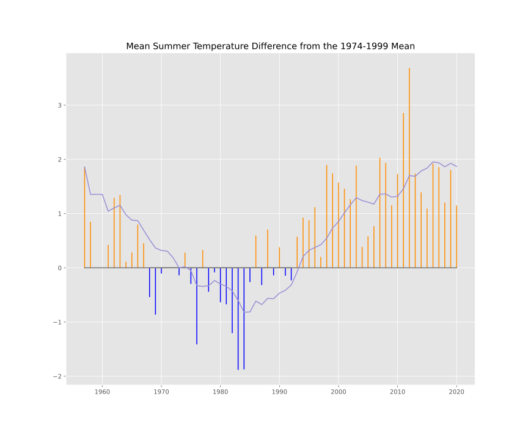
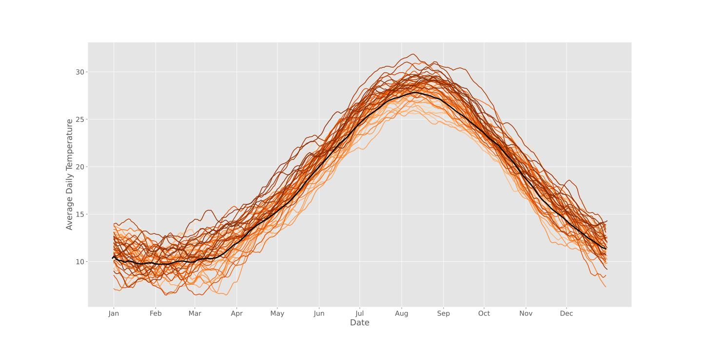
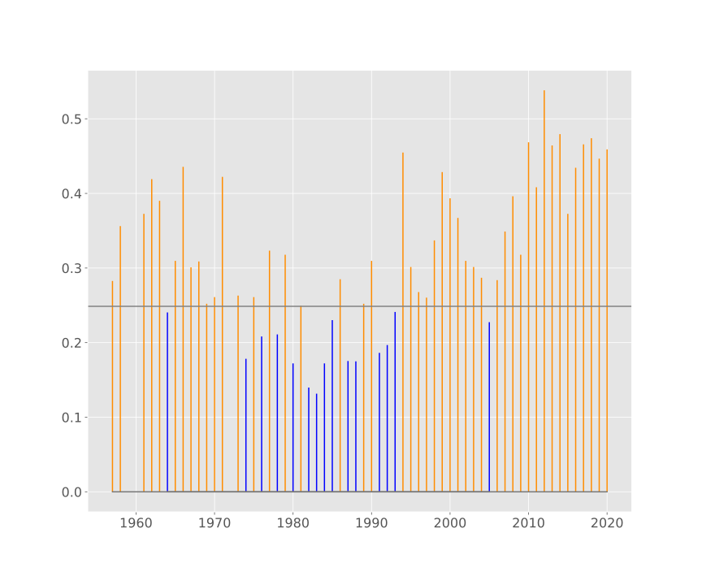
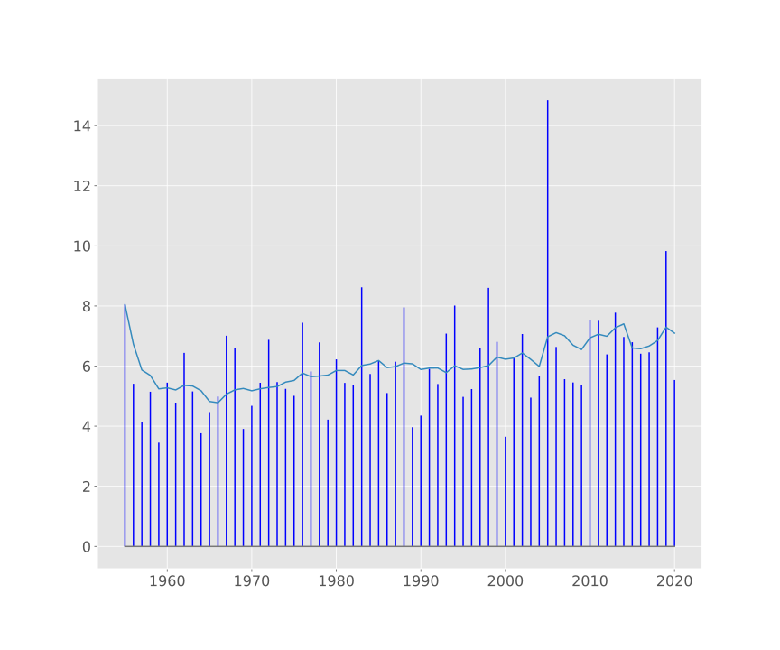

# Exploring the Weather in Athens

In this assignment you will explore the weather in Athens over a period
of more than 50 years.

> Panos Louridas, Associate Professor \
> Department of Management Science and Technology \
> Athens University of Economics and Business \
>  <louridas@aueb.gr>

## Questions

### Q1: Obtain the Data

You will work with data covering the period from 1955 to 2020. The data
will be obtained from two sources:

-   Data downloaded from the National Oceanic and Atmospheric
    Administration\'s National Centers for Environmental Information
    (<https://www.ncdc.noaa.gov/cdo-web/>) and in particular
    <https://www.ncdc.noaa.gov/cdo-web/search>.

-   As we are focusing on Athens, you will use the data from the
    Hellinikon weather station and you will concentrate on the average
    daily temperature and precipitation.

-   Explore the completeness of the data. What data are missing?

-   To fill in any missing data you will use an alternative dataset
    available from
    <https://data.hellenicdataservice.gr/dataset/66e1c19a-7b0e-456f-b465-b301a1130e3f>;
    this dataset covers only the period from 2010-2019.

### Q2: Deviation of Summer Temperatures

The Hellenic National Meteorological Service has published a report on
extreme weather events for 2020. The report is available at
<http://www.hnms.gr/emy/en/pdf/2020_GRsignificantEVENT_en.pdf>. In page
7 of the report there is a graph showing the mean summer temperature
deviation from a baseline of 1971-2000.

You will create your own version of the graph, using a baseline of
1974-1999. Your graph should look like the one below. The line that runs
through the graph is the 10 years rolling avarege of the deviation from
the mean. What is your intepretation of the figure?

### Q3: Evolution of Daily Temperatures

You will get the average temperate for each year for the full period
from 1955 to 2020. You will then create a plot showing the daily
temperature for each year. The line corresponding to each year will be
smoothed by using a 30 days rolling average. The lines are colored from
light orange to dark orange, progressing through the years in ascending
order.

On that plot you will overlay a line showing the average daily
temperature for the baseline period of 1974-1999 (that is the black
line). The line will also be smoothed usng a 30 years rolling average.
What is your interpretation of the figure?

### Q4: Extreme Temperature Events

Another mesure used by climatologists is the number of extreme events.
Extreme events are defined as those beyond 5% or 10% from the expected
value. We will deal with extreme heat events going 10% above the
baseline.

You will count the number of extreme temperature events per year,
compared to the baseline of 1974-1999. You should should produce a graph
like the one that follows. The vertical axis is the percentage of
extreme heat events calculated over the number of observations for each
year. The gray line in the middle is the average percentage of extreme
tempearture events of the baseline. The colour blue is used for those
years where the percentage is below the baseline; otherwise the colour
is orange. What is your interpretation of the graph?

### Q5: Precipitation

Continuing the thread on extreme events, another consideration is
rainfall. The weather may or may not be drying up. We are, however,
interested in whether precipication becomes more intense over time.

To see that, you will count the overall rainfall over the year and the
number of rainy days in each year. Then, by dividing the rainfall by the
number of rainy days you will get an indication of whether we are
getting rain in more concentrated bursts. You will then create a plot
showing the ratio of rainfall over rainy days over the years. On the
plot you will overlay the 10 years rolling average. The plot should be
similar to the one below. What is your interpretation of the plot?

## Submission Instructions

You will submit a Jupyter notebook that will contain all your code and
analysis. Ensure that the notebook will run correctly in a computer that
is not your own. That means, among other things, that it does not
contain absolute paths. Remember that a notebook is not a collection of
code cells thrown together; it should contain as much text as necessary
for a person to understand what you are doing.

## Honor Code

You understand that this is an individual assignment, and as such you
must carry it out alone. You may seek help on the Internet, by Googling
or searching in StackOverflow for general questions pertaining to the
use of Python, libraries, and idioms. However, it is not right to ask
direct questions that relate to the assignment and where people will
actually solve your problem by answering them. You may discuss with your
fellow students in order to better understand the questions, if they are
not clear enough, but you should not ask them to share their answers
with you, or to help you by giving specific advice.
